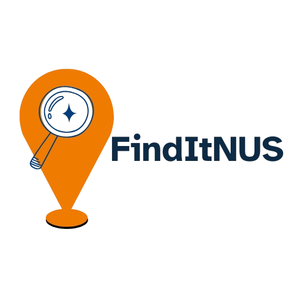
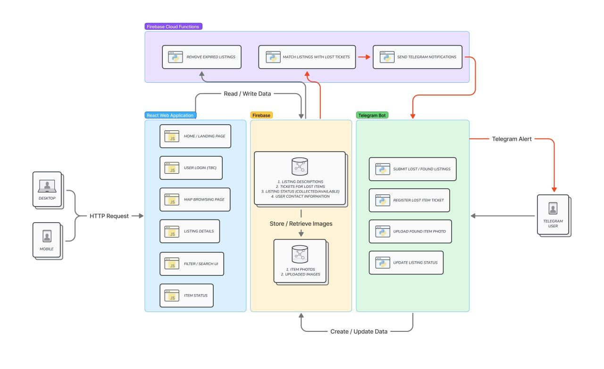

# Orbital 2026
### Unified Ecosystem for Campus Lost & Found

  

* Team Name: FindItNUS 
* Level of Achievement: Gemini

---

## Table of Contents
* [Description](#description)
* [Motivation](#motivation)
* [Aim](#aim)
* [User Stories](#user-stories)
  * [Milestone 1 (Current Baseline)](#user-stories---milestone-1)
  * [Milestones 2 & 3 (Future Scope)](#user-stories---future-scope)
  * [System Features](#system-features)
  * [Current Project Scope](#current-project-scope)
  * [Tech Stack](#tech-stack)
* [System Architecture](#system-architecture)
* [Frontend Application](#frontend-application)
* [Backend Application](#backend-application)
* [Database](#database)

---

## Description
FindItNUS is an all-in-one lost & found application designed specifically for the NUS Community. The system comprises of an asynchronous Telegram Bot with a responsive React-based web map layout. This allows students to visually track, browse, filter, and reclaim lost items easily.

## Motivation
Lost & found management within campus is traditionally fragmented across informal, unstructured Telegram channels. While these platforms provide a quick way to disseminate information, uploaded posts are often unstructured. Crucial metadata, such as the exact date, time, and precise geographical location of the item is often missing or ambiguous. 
Furthermore, listings are also not consistently updated after items have been returned to their owners, resulting in outdated or redundant postings. Consequently, users may need to spend significant time manually filtering through irrelevant posts when searching for their belongings.
A more organised and visually intuitive digital platform could improve how lost-and-found information is reported, searched and managed within the NUS community.

## Aim
We aim to bridge this gap by designing a unified, dual-interface platform.
1. A structured **Telegram Bot Interface** that standardizes item reporting right at the point of discovery.
2. An interactive **Find-My Style Web Interface** that maps reported items as precise spatial coordinate markers on top of the campus layout.

FindItNUS makes reclaiming lost possessions predictable, efficient, and reliable.

## User Stories

### User Stories - Milestone 1 (Current)
* **The Finder**: As a user who has found and kept an item, I want to create a structured listing via the Telegram bot so that the owner can contact me to arrange collection.
* **The Searcher**: As a user who has lost an item, I want to visually browse interactive map listings so I can quickly check if anything was reported near the locations I visited today.

### User Stories - Milestone 2 & 3
* **The Witness**: As a student rushing to a class who spots an item, I want to quickly report it as **Spotted** via the Telegram Bot to alert the community, without being forced to keep it in my possession.
* **The Reclaimer**: As a finder who created the listing, I want to use the Telegram Bot to toggle the item's state to '"reclaimed"' or delete it completely so it instantly disappears from the map layout.
* **The Suscriber**: As a user who lost an item, I want to register a subsription ticket via the Telegram Bot containing specific filter tags so the system can instantly send a push notification to my phone the moment a matching item is uploaded.

---

## System Features

### Feature 1: Conversational Telegram Bot Interface
* **Milestone 1 Implementation**: Built a basic interface using Python framework. Enforced structured listings for item details and campus location.
* **Milestone 2 Target**: Connect image upload pipelines so users can submit photos. Add options for finders to update an item's statusto "reclaimed" or "spotted".
* **Milestone 3 Target**: Implement the "Lost Ticket" matching system to send automated push alerts to searchers.

### Feature 2: Visual Web Map Interface
* **Milestone 1 Implementation**: Created the core map page and a sidebar gallery to display found items
* **Milestone 2/3 Target**: Fully integrate Leaflet and OpenStreetMap to show live, accurate pins derived from the cloud database.

### Feature 3: End-to-End Image Pipeline
* **Milestone 2 Target**: Set up cloud image processing. When a user uploads a photo via Telegram, the backend saves the image securely to Cloudinary, generates a link, and stores that link in Firebase. This ensures map pins display actual photos instead of placeholder text.

### Feature 4: Automated 14-Day Cleanup (TTL)
* **Milestone 2 Target**: Build an automatic background cleanup script using Firebase Scheduled Cloud Functions. The script will run automatically once every 24 hours to delete active listings that are older than 14 days with no updates, keeping the map clean.

## Current Project Scope
Milestone 1 focuses on proving that our core layout works. The bot successfully tracks conversational answers, and the frontend map page successfully loads and filters mock data tags.
In Milestone 2, we are moving our text data to Firebase and our images to Cloudinary, including many other features mentioned above.

## Tech Stack
* **Frontend**: React.js, TypeScript, Leadlet, Openstreetmap and Tailwind CSS.
* **Backend**: Python using python-telegram-bot library.
* **Database**: Google Firebase (Firestore) for text storage and Cloudinary for image hosting.

---

### System Architecture

Figure 1: High-level data flow diagram showing how the Telegram Bot, Database, and React Frontend communicate

---

## Frontend Application
* **`LandingPage.tsx`**:

## Backend Application
* **`config.py`**: Handles environmental variables and holds connection settings safely.
* **`database.py`**: Handles all reads, writes, updates and deletes for Firebase.
* **`storage.py`**: Handles sending and deleting images on Cloudinary.

## Database 
We use 2 main document collections in Firestore:
1. **`listings`**: Stores active item text descriptions, location labels, coordinates, status flags, and Cloudinary image links.
2. **`lost_tickets`**: Stores active search subscription tickets and filter tags created by users.