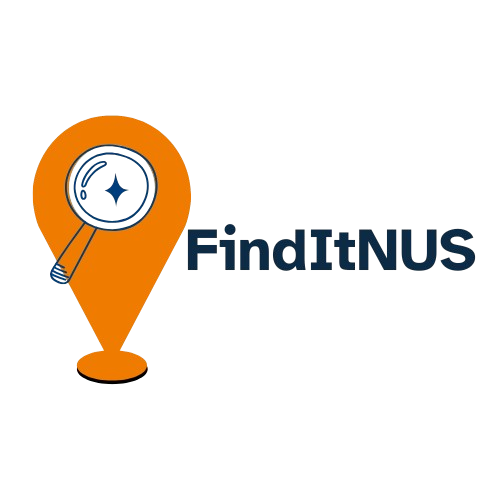
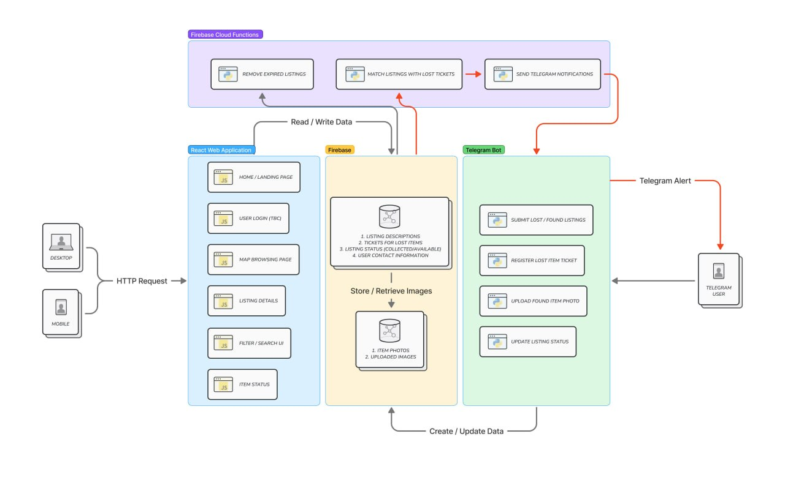

# Orbital 2026: FindItNUS
### Unified Ecosystem for Campus Lost & Found

  

* **Team ID:** 6807
* **Level of Achievement:** Gemini
* **Team Members:** Gavin & Wei Xiong
* **Milestone:** 2
* **Deployment:** [finditnus.vercel.app](https://finditnus.vercel.app)

---

## Table of Contents
* [Problem Motivation](#problem-motivation)
* [Target Audience & User Stories](#target-audience-user--stories)
* [Our Solution](#our-solution)
* [System Features](#system-features)
* [Tech Stack](#tech-stack)
* [System Architecture](#system-architecture)
* [Planning & Version Control](#planning-version-control)
* [Technical Proof of Concept](#technical-proof-of-concept)
* [Testing](#testing)
* [Development Plan](#development-plan)
* [Frontend Application](#frontend-application)
* [Backend Application](#backend-application)
* [Database](#database)

---

## Problem Motivation
Lost & found management within campus is traditionally fragmented across informal, unstructured Telegram channels. While these platforms provide a quick way to disseminate information, uploaded posts are often unstructured. Crucial metadata, such as the exact date, time, and precise geographical location of the item is often missing or ambiguous. 
Furthermore, listings are also not consistently updated after items have been returned to their owners, resulting in outdated or redundant postings. Consequently, users may need to spend significant time manually filtering through irrelevant posts when searching for their belongings.
A more organised and visually intuitive digital platform could improve how lost & found information is reported, searched and managed within the NUS community.

---

## Target Audience & User Stories
**Primary Users:** NUS students and staff who frequently commute around the school campus and need an immediate, localized way of reporting or tracking misplaced belongings.

**Secondary Users:** Campus security and student club leaders who manage physical lost & found boxes and need a digital inventory to broadcast unclaimed items.

* **The Finder**: As a user who has found and kept an item, I want to create a structured listing via the Telegram bot so that the owner can contact me to arrange collection.
* **The Loser**: As a user who has lost an item, I want to visually browse interactive map listings so I can quickly check if anything was reported near the locations I visited today.
* **The Spotter**: As a student rushing to a class who spots an item, I want to quickly report it as Spotted via the Telegram Bot to alert the community, without being forced to keep it in my possession.
* **The Reclaimer**: As a finder who created the listing, I want to use the Telegram Bot to toggle the item's state to reclaimed or delete it completely so it instantly disappears from the map layout.
* **The Subscriber**: As a user who lost an item, I want to register a subscription ticket via the Telegram Bot containing specific filter tags so the system can instantly send a push notification to my phone the moment a matching item is uploaded.

---

## Our Solution
FindItNUS is an all-in-one lost & found application designed specifically for the NUS Community. The system comprises of an asynchronous Telegram Bot with a responsive React-based web map layout. This allows students to visually track, browse, filter, and reclaim lost items easily.

We aim to bridge this gap by designing a unified, dual-interface platform.
1. A structured **Telegram Bot Interface** that standardizes item reporting right at the point of discovery.
2. An interactive **Find-My Style Web Interface** that maps reported items as precise coordinate pins on top of the campus layout map, showing visual preview cards of corresponding lost items.

FindItNUS makes reclaiming lost possessions predictable, efficient, and reliable.

---

### System Features

**Feature 1: Conversational Telegram Bot Interface**
* **Milestone:** 2
* **Status:** Implemented
* **User role:** Public user / Registered user
* **What it does:** Provides a user-facing Telegram chat client that routes actions across adaptive workflows (Finders vs. Spotters vs. Losers) with custom buttons and navigation buttons to standardize item reporting.
* **Complexity justification:** Requires implementing a robust multi-state message router within the Telegram API to manage conversational context, record user inputs accurately, and allow users to backtrack without affecting the database payload.
* **Design Decisions:** We chose inline dynamic keyboards over raw text parsing to strictly control data validation and eliminate edge-case data corruption before it reaches our database.

**Feature 2: Structured Campus Location Navigator**
* **Milestone:** 2
* **Status:** Implemented
* **User role:** Public user
* **What it does:** Replaces messy text and image inputs with a multi-tiered keyboard tree linking broad faculty zones to localized landmark points, automatically converting raw button tags into coordinates and human-readable labels.
* **Complexity justification:** Requires a robust coordinate registry mapping logic, alongside dynamic routing for custom text spots and pairs them with the baseline coordinates of surrounding faculty zones.
* **Design decisions:** We implemented a randomized coordinate offset (Jitter) algorithm to ensure predefined landmark map pins dont invisibly stack on top of each other.

**Feature 3: Personal Listing Portfolio Manager**
* **Milestone:** 2
* **Status:** Implemented
* **User role**: Registered user
* **What it does:** Provides a `/manage` command dashboard giving students full ownership to view, update statuses (e.g. active → reclaimed), or permanently delete their submitted reports directly inside Telegram.
* **Complexity justification:** Requires asynchronous query scripts to filter database records by chat ID, alongside backend utilities that synchronously wipe documents out of database without manual intervention.
* **Design decisions:** We attached an inline interaction row directly inside the Telegram bot which allows for rapid, one-click inventory actions without forcing the user to open a separate web portal.

**Feature 4: End-to-End Image Processing Pipeline**
* **Milestone:** 2
* **Status:** Implemented
* **User role:** Public user / Registered user
* **What it does:** An automated image pipeline which optimizes and uploads images of found items to Cloudinary and syncing it to the database payload.
* **Design decisions:** We offloaded image storage completely to Cloudinary instead of Firestore to isolate media bandwidth and bypass Firebase pricing limits.

**Feature 5: Live Visual Web Map & Gallery Dashboard**
* **Milestone:** 2
* **Status:** Implemented
* **User role:** Public user
* **What it does:** A public website mapping campus lost & found items across interactive visual coordinates with corresponding visual preview cards.
* **Complexity justification:** Establishing real-time reading loops connecting the frontend to Firestore database dynamically, ensuring instant pin rendering without browser refresh.
* **Design decisions:** We built our interface with React and Next.js, utilizing Leaflet and OpenStreetMap integrations to handle the visual map tiles.

**Feature 6: Intelligent "Lost Ticket" Matchmaking Engine**
* **Milestone:** 3
* **Status:** Not started
* **User role:** Registered user
* **What it does:** An active notification service that cross-references newly found item reports against missing item requests to dispatch instant push notifications.
* **Complexity justification:** Requires an automated background query thread across multiple Firestore collections based on category and location of item.
* **Design decisions:** We would be using Telegram deep-linking for the claim handshake system to create a secure bridge between the web-interface and the Finder's private chat.

**Feature 7: Automated Map Cleanup (14-day TTL)**
* **Milestone:** 3
* **Status**: Not started
* **User role:** Admin
* **What it does:** A background script that automatically deletes item listings and map pins once they are older than 14 days.
* **Complexity justification:** Requires building a scheduled thread that can access the database, compare timestamps and run batch deletions without interrupting the main bot and also ensures that it triggers a cleanup of the associated Cloudinary image.
* **Design decisions:** Instead of building a custom cron job, we will be utilizing Firestore's native TTL expiry rules.

---

## Tech Stack
| Layer | Technology | Why we chose it |
| :--- | :--- | :--- |
| **Frontend** | React / Next.js | High component reusability for map UI, excellent state management, and seamless integration with Leaflet mapping libraries. |
| **Backend** | Python (`python-telegram-bot`) | Python offers unparalleled speed for scripting asynchronous state-machines and processing binary image buffers. |
| **Database** | Firebase Firestore | A NoSQL document database fits our schema perfectly, allowing real-time websocket synchronization directly to the frontend. |
| **Storage** | Cloudinary API | Offloads heavy image hosting from our database; handles dynamic image down-sampling and secure signature validation. |
| **Hosting** | Vercel | Designed specifically for Next.js applications, offering seamless CI/CD pipeline deployments from Github. |

---

## System Architecture

Figure 1: High-level data flow diagram showing how the Telegram Bot, Database, and React Frontend communicate

**Explanation:**
The system is heavily decoupled via Firestore. The Python bot acts as the primary "Write" client, packing user inputs into standard JSON payloads. The React application hosted on Vercel acts as the "Read" client. Cloudinary exists as a parallel storage node to isolate media bandwidth from our primary database queries.

**Key User Journey:**
1. **The Finder (Data Creation):**
   * *Steps:* User opens Telegram bot `/start` ➔ Clicks "I Found an Item" ➔ Navigates "Computing" > "COM1" ➔ Uploads photo ➔ Enters description ➔ Payload is saved to Firestore.
   * *Outcome:* The item instantly appears as a clickable pin on the live web map.
2. **The Loser (Data Retrieval):**
   * *Steps:* User launches the web portal via the `/website` command ➔ Filters the interactive Leaflet map by the "Computing" zone ➔ Clicks a pin to view the uploaded photo and description.
   * *Outcome:* User identifies their item and uses the details to retrieve it.
3. **The Spotter (Rapid Ping):**
   * *Steps:* User opens bot `/start` ➔ Clicks "I Spotted an Item" ➔ Selects "Central Library" ➔ Takes a quick photo.
   * *Outcome:* A `Status: "spotted"` pin is added to the map alerting the community, without the user taking the item.
4. **The Reclaimer (Data Cleanup):**
   * *Steps:* Finder opens bot ➔ Runs `/manage` ➔ Selects the active item ➔ Clicks "Mark as Reclaimed".
   * *Outcome:* The Firestore status updates to `reclaimed`, instantly removing the pin from the active web map.

---

## Planning & Version Control
* **GitHub Repository:** [https://github.com/Lokwx/Orbital_FindItNUS](https://github.com/Lokwx/Orbital_FindItNUS)
* **Branching Strategy:** We maintain a `main` branch for production codes and separate feature branches for isolated development. Manual testing are required before merging to the shared codebase.
* **Commit Conventions:** We enforce strict conventional commits to map updates to specific features, bug fixes, or documentation. Some examples from our development include:
    * `feat: added /website and /manage dashboard logic`
    * `fix: update the recent icons with google map icons`

---

## Technical Proof of Concept
**Live System Demo:** [https://finditnus.vercel.app](https://finditnus.vercel.app)

**What the POC demonstrates:**
1. A user can open the Telegram bot, navigate the state-machine, and upload an image of a found item. This data is successfully persisted to our Firestore `listings` collection.
2. The image is passed through our Cloudinary pipeline and generates a secure URL.
3. The React frontend actively listens to the database and instantly renders the Leaflet map pin and sidebar gallery card with the correct image and jitter offsets applied.
4. A user can execute the `/manage` command in Telegram to mark their live listing as "reclaimed," which successfully updates the frontend UI dynamically.

---

## Testing

### Testing Strategy 
We employed manual system testing to verify our core end-to-end system between frontend and backend.

| Test Case | Steps | Expected Result | Actual Result | Pass? |
| :--- | :--- | :--- | :--- | :--- |
| **Finder Workflow (Data creation)** | 1. Open Telegram bot and run `/start`. 2. Select "Finder" ➔ "UTown" ➔ "Fine Food". 3. Upload test image and text. 4. Open Web Map. | The bot confirms upload. The web map instantly displays a new pin at UTown with the corresponding image and "Found" visual indicator. | As expected. | ✅ |
| **Spotter Workflow (Data creation)** | 1. Open Telegram bot and run `/start`. 2. Select "Spotter" ➔ "Central Library" ➔ "Main Building". 3. Upload test image and text. 4. Open Web Map. | The bot confirms upload. The web map instantly displays a new pin at Central Library with the corresponding image and "Spotted" visual indicator. | As expected. | ✅ |
| **Loser Workflow (Item retrieval)** | 1. Open Telegram bot and run `/website`. 2. Open the Web Map. 3.Navigate the Web Map to a specific faculty zone. 4. Click on an active item pin. | The Web Map loads seamlessly. Clicking the pin successful opens the preview card display the exact item description and details. Click on the "Claim item" button to open a secure chat with the Finder. | As expected. | ✅ |
| **Portfolio Sync (Data update)** | 1. Open bot and run `/manage`. 2. Select the item just created. 3. Click "Mark as Reclaimed". 4. Check Web Map. | The item's status flag in Telegram updates to "Reclaimed". The Web Map UI filters it out. | As expected. | ✅ |
| **Listing Deletion (Data wipe)** | 1. Open bot and run `/manage`. 2. Click "Delete Entirely". 3. Check Web Map. | The item is wiped from Firestore and immediately vanishes from the Web Map. | As expected. | ✅ |
---

## Development Plan

**Completed (By Milestone 2)**
* Feature 1: Conversational Telegram Bot Interface
* Feature 2: Structured Campus Location Navigator
* Feature 3: Personal Listing Portfolio Manager (/manage)
* Feature 4: End-to-End Image Processing Pipeline
* Feature 5: Live Visual Web Map & Gallery Dashboard

**Planned for Milestone 3**
* Feature 6: Intelligent "Lost Ticket" Matchmaking Engine
* Feature 7: Automated Map Cleanup (14-day TTL)
* Comprehensive UI/UX updates across the web dashboard
* Executing user testing to gather feedback

**Risks and Mitigations:**
* **Risk:** Data formatting desync between the frontend and backend.
* **Mitigation:** We established a JSON schema database payload that should not be modified to prevent map rendering crashes.

---
## Frontend Application
* **`LandingPage.tsx`**:

## Backend Application
* **`config.py`**: Handles environmental variables and holds connection settings safely.
* **`database.py`**: Handles all reads, writes, updates and deletes for Firebase.
* **`storage.py`**: Handles sending and deleting images on Cloudinary.

## Database 
We use 2 main document collections in Firestore:
1. **`listings`**: Stores active item text descriptions, location labels, coordinates, status flags, and Cloudinary image links.
2. **`lost_tickets`**: Stores active search subscription tickets and filter tags created by users.
